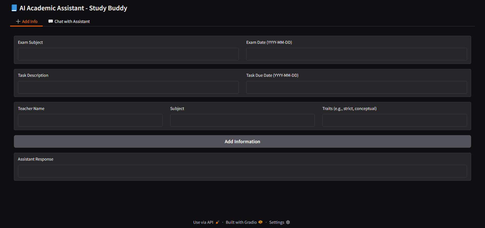
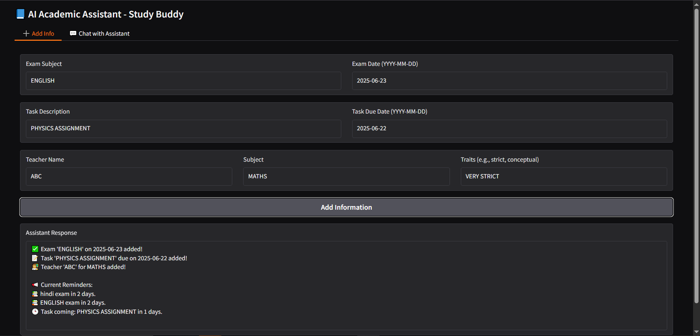
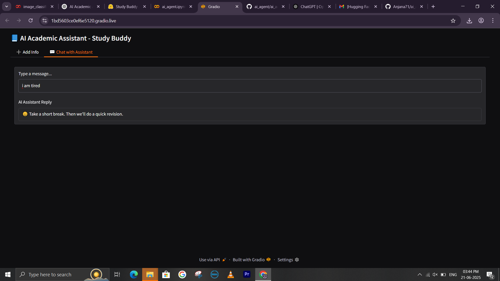
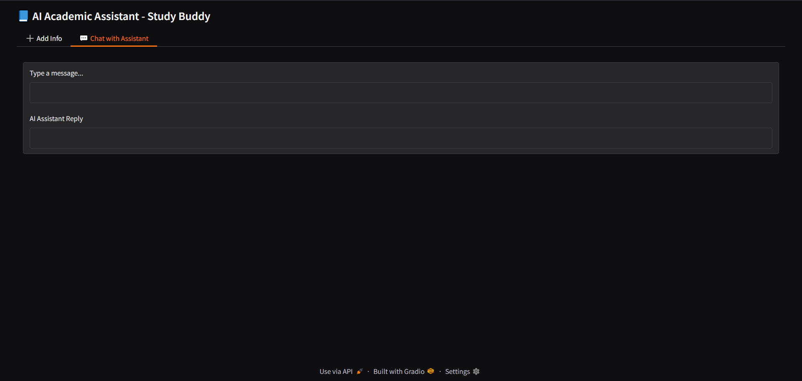
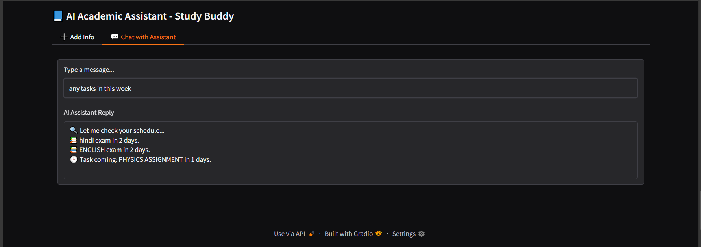

# AI Academic Assistant 🧠

This is a smart AI study buddy built with Python + Gradio in Colab.

## 💡 Features
- Add exams, tasks, teacher info
- Get smart daily reminders
- Friendly chat-style interaction

## 📸 Screenshots

### 🎛 Gradio UI

### 📅 Reminder Output

### 💬 Chat Response

